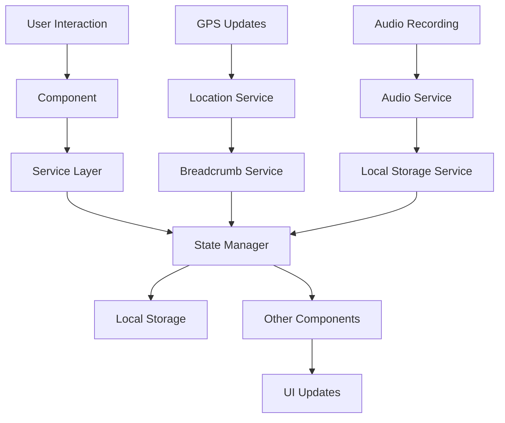

# BioMapp Architecture Documentation

## 🏗️ **Architectural Overview**

BioMapp is a React-based bioacoustic mapping application with Capacitor for mobile deployment. This document outlines the enhanced architecture implemented to improve interoperability and support new features like breadcrumb visibility and soundwalk sharing.

## 📁 **Project Structure**

```
src/
├── types/                    # TypeScript type definitions
│   └── biomapp.types.ts     # Unified data models
├── services/                # Core business logic services
│   ├── biomappStateManager.js      # Centralized state management
│   ├── audioPlaybackService.js     # Unified audio playback
│   ├── soundwalkSharingService.js  # Export/import functionality
│   ├── breadcrumbService.js        # GPS breadcrumb tracking
│   ├── localStorageService.js      # Data persistence
│   ├── locationService.js          # GPS/location handling
│   └── permissionManager.js        # Permission management
├── components/              # React components
│   ├── unified/            # Consolidated components (future)
│   ├── BaseMap.jsx         # Core map functionality
│   ├── BreadcrumbVisualization.jsx # Breadcrumb rendering
│   ├── SharedTopBar.jsx    # Unified top navigation
│   ├── SharedMarkerUtils.js # Marker creation utilities
│   ├── SoundWalk.jsx       # Web soundwalk interface
│   ├── SoundWalkAndroid.jsx # Android soundwalk interface
│   └── MapContainer.jsx    # Collector mode interface
├── utils/                  # Utility functions
│   ├── dataValidator.js    # Data validation and sanitization
│   └── recordingExporter.js # File export utilities
└── assets/                 # Static assets
```

## 🎯 **Core Architecture Principles**

### **1. Unified Data Models**
All components now use standardized interfaces defined in [`biomapp.types.ts`](src/types/biomapp.types.ts):

- **BioMappRecording**: Standardized recording format
- **BioMappLocation**: Consistent location data structure
- **BioMappBreadcrumb**: Unified breadcrumb format
- **BioMappExportPackage**: Standardized export format

### **2. Centralized State Management**
[`biomappStateManager.js`](src/services/biomappStateManager.js) provides:

- Cross-component state synchronization
- Persistent storage integration
- Event-driven updates
- Memory-efficient state handling

### **3. Service-Oriented Architecture**
Core functionality is encapsulated in dedicated services:

- **Audio Playback**: Centralized in [`audioPlaybackService.js`](src/services/audioPlaybackService.js)
- **Data Sharing**: Handled by [`soundwalkSharingService.js`](src/services/soundwalkSharingService.js)
- **Location Tracking**: Managed by [`locationService.js`](src/services/locationService.js)
- **Breadcrumb Tracking**: Controlled by [`breadcrumbService.js`](src/services/breadcrumbService.js)

### **4. Component Reusability**
Shared utilities eliminate code duplication:

- **Marker Creation**: [`SharedMarkerUtils.js`](src/components/SharedMarkerUtils.js)
- **Top Navigation**: [`SharedTopBar.jsx`](src/components/SharedTopBar.jsx)
- **Breadcrumb Visualization**: [`BreadcrumbVisualization.jsx`](src/components/BreadcrumbVisualization.jsx)

## 🔄 **Data Flow Architecture**



## 🎵 **Audio Playback System**

The [`audioPlaybackService.js`](src/services/audioPlaybackService.js) provides unified audio functionality:

### **Playback Modes**
- **Single**: Play individual recordings
- **Nearby**: Sequential playback of recordings within range
- **Concatenated**: Play recordings as one continuous stream
- **Jamm**: Simultaneous playback of multiple recordings

### **Features**
- Proximity-based volume adjustment
- Cross-fade capabilities
- Memory management for large audio files
- Platform-specific optimizations

## 📍 **Breadcrumb System**

### **Real-time Tracking**
[`breadcrumbService.js`](src/services/breadcrumbService.js) provides:

- Adaptive GPS frequency (1s moving, 3s stationary)
- Movement detection and speed calculation
- Audio level integration
- Douglas-Peucker path compression

### **Visualization**
[`BreadcrumbVisualization.jsx`](src/components/BreadcrumbVisualization.jsx) supports:

- **Line Mode**: Connected path visualization
- **Heatmap Mode**: Audio intensity-based coloring
- **Markers Mode**: Individual breadcrumb points
- **Animated Mode**: Playback of recorded path

## 📤 **Export/Import System**

### **Export Formats**
[`soundwalkSharingService.js`](src/services/soundwalkSharingService.js) supports:

```json
{
  "biomapp_export": {
    "version": "2.0.0",
    "export_type": "soundwalk_package",
    "recordings": [...],
    "tracklog": {...},
    "metadata": {...}
  }
}
```

### **Sharing Methods**
- **File Export**: JSON packages with embedded audio
- **QR Codes**: Metadata-only sharing for quick preview
- **Platform Integration**: Android share intents, web file APIs

## 🔧 **Data Validation**

[`dataValidator.js`](src/utils/dataValidator.js) ensures data integrity:

- Recording format validation
- Location coordinate verification
- Export package structure validation
- Data sanitization and error reporting

## 🎨 **Marker System**

[`SharedMarkerUtils.js`](src/components/SharedMarkerUtils.js) provides:

### **Marker Types**
- **Duration Circles**: Size-based on recording length
- **User Location**: Pulsing blue indicator
- **Breadcrumbs**: Movement and audio-based coloring
- **Direction Arrows**: Movement direction indicators

### **Customization Options**
- Color schemes based on audio properties
- Size scaling for different zoom levels
- Animation effects for active states
- Accessibility considerations

## 🔄 **State Management**

### **Global State Structure**
```javascript
{
  recordings: [],           // All audio recordings
  currentSession: null,     // Active recording session
  breadcrumbs: [],         // Current breadcrumb trail
  userLocation: null,      // User's GPS position
  locationPermission: 'unknown', // GPS permission state
  isRecording: false,      // Recording state
  currentAudio: null,      // Currently playing audio
  isPlaying: false,        // Playback state
  nearbySpots: [],         // Recordings within range
  tracklog: [],            // Historical GPS path
  currentLayer: 'OpenStreetMap', // Active map layer
  showBreadcrumbs: false,  // Breadcrumb visibility
  breadcrumbVisualization: 'line' // Visualization mode
}
```

### **State Persistence**
- Recordings and tracklog saved to localStorage
- User preferences preserved across sessions
- Automatic cleanup of old data
- Migration support for format changes

## 🚀 **Performance Optimizations**

### **Memory Management**
- Lazy loading of audio blobs
- Breadcrumb compression using Douglas-Peucker algorithm
- Automatic cleanup of unused audio references
- Efficient state updates with minimal re-renders

### **Mobile Optimizations**
- Capacitor-specific audio handling
- Battery-efficient GPS tracking
- Adaptive quality based on device capabilities
- Offline-first data storage

## 🔐 **Security Considerations**

### **Data Privacy**
- All data stored locally by default
- Optional cloud sync with user consent
- Audio data never transmitted without explicit user action
- Location data anonymization options

### **Input Validation**
- All user inputs validated and sanitized
- File upload restrictions and virus scanning
- SQL injection prevention in search functionality
- XSS protection in user-generated content

## 🧪 **Testing Strategy**

### **Unit Tests**
- Service layer functionality
- Data validation and sanitization
- Utility function correctness
- State management operations

### **Integration Tests**
- Component interaction workflows
- Service integration points
- Export/import functionality
- Cross-platform compatibility

### **End-to-End Tests**
- Complete user workflows
- Audio recording and playback
- GPS tracking and breadcrumb generation
- Sharing and import processes

## 📱 **Platform Support**

### **Web Browsers**
- Chrome/Chromium (recommended)
- Firefox with WebRTC support
- Safari with media permissions
- Edge with modern web APIs

### **Mobile Platforms**
- Android 7.0+ via Capacitor
- iOS support planned for future release
- Progressive Web App capabilities
- Offline functionality

## 🔄 **Migration Guide**

### **From Previous Versions**
1. Data format automatically migrated on first load
2. Breadcrumb data converted from tracklog format
3. Audio files remain compatible
4. User preferences preserved

### **Breaking Changes**
- Component prop interfaces updated
- Service method signatures changed
- Export format version bump to 2.0.0
- Some legacy APIs deprecated

## 🛠️ **Development Workflow**

### **Adding New Features**
1. Define types in [`biomapp.types.ts`](src/types/biomapp.types.ts)
2. Implement service layer logic
3. Update state manager if needed
4. Create/modify components
5. Add validation rules
6. Write tests
7. Update documentation

### **Code Standards**
- ESLint configuration for consistency
- Prettier for code formatting
- JSDoc comments for all public APIs
- TypeScript for type safety where applicable

## 📈 **Future Enhancements**

### **Planned Features**
- Real-time collaboration between users
- Cloud synchronization with conflict resolution
- Advanced audio analysis and species identification
- Machine learning-based soundscape classification
- Integration with external biodiversity databases

### **Technical Improvements**
- WebAssembly for audio processing
- Service Worker for better offline support
- WebRTC for peer-to-peer sharing
- IndexedDB for larger data storage
- Web Workers for background processing

## 🤝 **Contributing**

### **Development Setup**
```bash
npm install
npm run dev
```

### **Building for Production**
```bash
npm run build
```

### **Mobile Development**
```bash
npx cap sync
npx cap run android
```

## 📞 **Support**

For technical questions or architectural discussions, please refer to:
- Component documentation in individual files
- Service API documentation in JSDoc comments
- Type definitions in [`biomapp.types.ts`](src/types/biomapp.types.ts)
- Test files for usage examples

---

**Last Updated**: January 2025  
**Architecture Version**: 2.0.0  
**Compatibility**: BioMapp 2.0.0+