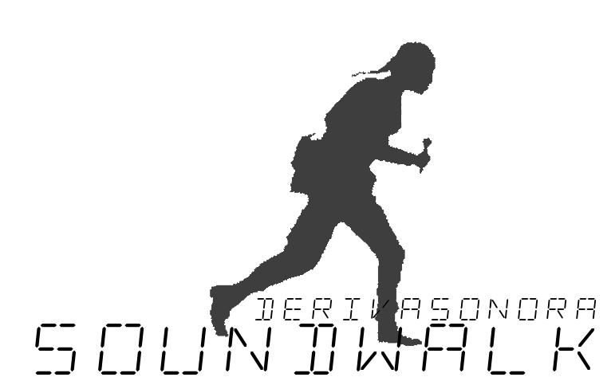

<p align="center">
  
</p>

<p align="center"><strong>DerivaSonora / SoundWalk Recorder</strong></p>

**ES** — App de mapeo sonoro comunitario. Graba audio geoetiquetado, camina derivas sonoras con tracklog GPS y exporta paquetes ZIP compartibles. Construida con React 18 + Vite, funciona en Android (Capacitor) y navegadores web. Ideal para ciencia ciudadana, investigacion de campo y amantes de la naturaleza.

**EN** — Community sound mapping app. Record geo-tagged audio, walk sonic derives with GPS tracklogs, and export shareable ZIP packages. Built with React 18 + Vite, runs on Android (Capacitor) and web browsers. Ideal for citizen science, field research, and nature enthusiasts.

## Features / Funcionalidades

### Core Features
- **Deriva Sonora** — GPS-tracked walks that auto-start when you move >5m, auto-stop after 10 min inactivity. Timer, distance and recording counter. Breadcrumb trail always visible (animated by default). Smart session visibility shows most relevant derive on launch.
- **Audio recording** — Geo-tagged recordings with rich bioacoustic metadata (5-minute timer, auto-save). Offline-first via localStorage with automatic filesystem fallback for large files (>5MB). Preferred format: `audio/mp4` for cross-platform compatibility. **Upload audio files** via Plus (+) icon — MP4/M4A/WebM/OGG/WAV up to 6MB with current GPS location assigned.
- **Delete recordings** — Trash icon on sound blob popups with confirmation; deletes audio file and metadata while preserving associated derive data.
- **Playback modes** — Nine modes spanning bioacoustic science and sound art (see below).
- **Dynamic spatial audio (Cercanos mode)** — Volume and stereo panning update in real-time (200ms) based on distance and bearing as you walk. Playing markers animate with green pulsing glow. Max 6 concurrent streams (closest sounds prioritized) for performance on mid-range devices. Instant loading modal dismiss for responsive UI.
- **Breadcrumb visualization** — Line (GPS tracklog with audio-level coloring), heatmap, animated (default). Per-derive colored tracklines with simplified rendering (60-80% fewer points via Ramer-Douglas-Peucker decimation). Stale breadcrumbs cleared on relaunch.
- **Auto-zoom** — Map zoom adjusts logarithmically as you walk: starts at street level (z19), smoothly zooms out as distance grows. Manual pinch overrides until GPS recenter. Zoom-scaled marker circles prevent overlap at low zoom levels.
- **Import/Export** — Import derive ZIPs (Deriva Sonora v2.1, audio-only ZIPs, legacy formats). Export to:
  - **BioMapp native**: ZIP packages with audio + metadata + tracklog
  - **Bioacoustic standard formats**: Raven Pro selection tables, Audacity labels, GPX waypoints (QGIS/ArcGIS compatible)
- **Multi-layer map** — 7 tile providers: OpenStreetMap, OpenTopoMap, CartoDB, OSM Humanitarian, Stadia Satellite, Esri World Imagery, CyclOSM (Leaflet). Proper `maxNativeZoom` per provider prevents blank tiles.

## Playback Modes / Modos de Reproducción

BioMapp approaches sound from two fronts simultaneously: **bioacoustic field research** and **sound art / SoundWalk practice**. Each playback mode serves one or both.

### Bioacustica

| Mode | ES Name | Description |
|------|---------|-------------|
| **Nearby** | Cercanos | Dynamic spatial audio from all recordings within 50m (regardless of derive layer visibility). Volume and stereo panning update every 200ms as you walk — exponential decay from full volume at ≤5m to ~10% at 50m edge. Playing markers pulse with green animation. Max 6 concurrent sounds (closest prioritized). Instant playback start with non-blocking audio loading. |
| **Reloj** | Reloj | Plays recordings made within a configurable time window (±15, ±30, or ±60 min) of the *current time of day*, across all visible layers. At 6:15 AM you hear what the reserve sounded like at 6:15 on every previous session day. Useful for tracking dawn chorus shifts over time. |
| **Alba** | Alba | Solar bridge: listen to dawn recordings from any location during *your* local dawn. Uses solar declination to compute dawn windows for both listener (gate) and recording origin (filter). If you recorded birds at dawn in the Amazon and someone plays Alba in Madrid, they hear the Amazonian dawn chorus — but only when it's dawn in Madrid. |
| **Crepúsculo** | Crepúsculo | Solar bridge: listen to dusk recordings from any location during *your* local dusk. Same solar declination logic as Alba but for evening hours. Connects distant soundscapes through synchronized solar cycles. |
| **Estratos** | Estratos | Builds the soundscape layer by layer, staggered every 4 s: insects → birds → amphibians → mammals → water → ambient/other. Expanded keyword matching (~60 species/sound terms). Tags added during recording drive the classification. Useful for teaching ecological composition. |

### Arte Sonoro

| Mode | ES Name | Description |
|------|---------|-------------|
| **Chronological** | Cronológico | Recordings in capture order with true 500 ms crossfade overlap between tracks. Scientifically faithful replay of the session as it happened. |
| **Jamm** | Jamm | All tracks simultaneously with automated L↔R panning. Random start offset per track for varied texture on each play. The longest file leads; shorter ones loop. Dense, immersive soundscape. |
| **Migratoria** | Migratoria | Plays imported derives in geographic/timestamp order with 500 ms crossfade. A bioacoustic journey across locations — ideal for touring soundscapes collected by different users or at different sites. |
| **Espectro** | Espectro | Sorts recordings by frequency band heuristic (sub-bass → low → mid → high) and plays them as a spectral sweep with 600 ms crossfade. An educational mode for exploring how different species occupy the frequency spectrum. |

## Recording Metadata / Metadatos de Grabación

Each recording captures a rich set of fields designed for AI-ready bioacoustic analysis:

| Field | Source | Description |
|-------|--------|-------------|
| GPS (lat, lng) | Auto | Recording coordinates |
| Altitude | Auto | Elevation in meters (from GPS) |
| GPS Accuracy | Auto | Position confidence in meters |
| Device Model | Auto | Microphone/phone identifier for spectral calibration |
| Timestamp | Auto | ISO datetime of capture |
| Duration | Auto | Recording length in seconds |
| Movement Pattern | Auto | Walking pattern from breadcrumb tracking |
| Habitat | User | Bosque, Humedal, Pastizal, Ribera, Urbano, Cultivo, Páramo, Manglar, Cueva |
| Vertical Stratum | User | **Sound source origin** (not microphone position): Suelo (<2m — anfibios, insectos), Sotobosque (2-15m — aves de matorral), Dosel (>15m — aves arborícolas, primates), Aéreo, Subacuático. Optional field, default: "No identificado" |
| Distance Estimate | User | <5m, 5–20m, 20–50m, >50m |
| Activity Type | User | Canto, Alarma, Forrajeo, Desplazamiento, Coro, Desconocido |
| Species Tags | User | Multi-select: Ave, Mamífero, Anfibio, Reptil, Insecto, Agua, Viento, Humano |
| Anthropophony | User | Human noise level: Ninguna, Baja, Media, Alta |
| Weather | User | Soleado, Nublado, Lluvioso, Tormentoso, Niebla, Ventoso, Nevado |
| Temperature | User | Range brackets from <0°C to >30°C |
| Quality | User | Baja, Media, Alta |
| Notes | User | Free-text field |

## Scientific Interoperability / Interoperabilidad Científica

BioMapp exports to established bioacoustic analysis formats for integration with professional workflows:

### Raven Pro Selection Tables (.txt)
- Tab-separated format compatible with Cornell Raven Pro
- Includes: GPS coordinates, species tags, vertical stratum, habitat, distance, timestamp, quality
- Use case: Import into Raven for spectrographic analysis and annotation

### Audacity Labels (.txt)
- Timeline format: `StartTime\tEndTime\tLabel`
- Labels include species, stratum, habitat, timestamp
- Use case: Direct import into Audacity for audio annotation and editing

### GPX Waypoints
- Georeferenced acoustic markers for QGIS, ArcGIS, Google Earth
- XML extensions include: duration, species, stratum, habitat
- Use case: Spatial analysis, acoustic richness mapping, overlay with environmental layers

All exports accessible via **⬇️ Import/Export** modal → **Export** tab → **Formatos bioacústicos estándar**

## Roadmap / Hoja de Ruta

### Near-term (1-2 months)
- **Acoustic indices (ACI, ADI, H')** — On-device calculation of Acoustic Complexity Index, Acoustic Diversity Index, Shannon Entropy for quantitative biodiversity assessment (~1-2 weeks development + validation)

### Medium-term (3-6 months)
- **Community species labeling** — Offline collaborative tagging to build training datasets for regional ML models

### Long-term (6+ months)
- **On-device ML species detection** — Lightweight inference for Neotropical dry forest taxa (requires curated dataset of 1000+ recordings per species)
- **Multi-device spatial arrays** — Coordinated simultaneous recording for sound propagation analysis

### Deferred / Not Planned
- ❌ Real-time species alerts (battery drain)
- ❌ Cloud ML processing (conflicts with offline-first, community-owned data philosophy)

See [CHANGELOG.md](CHANGELOG.md) for detailed roadmap and full release history.

## Quick Start

```bash
npm install
npm run dev          # http://localhost:5173
npm run build        # dist/
```

## Stack

**Frontend**: React 18, Vite, MUI (Material-UI), Lucide icons
**Mapping**: Leaflet (7 tile providers with proper `maxNativeZoom`)
**Mobile**: Capacitor 5 (Android/iOS), native filesystem for large audio files
**Audio**: Web Audio API, MediaRecorder (`audio/mp4` preferred), VoiceRecorder plugin
**Data**: JSZip (export/import), localStorage (metadata), Capacitor Filesystem (>5MB blobs)
**Geospatial**: GeoJSON, GPX export, GPS breadcrumb tracking with Ramer-Douglas-Peucker simplification
**Bioacoustic exports**: Raven Pro selection tables, Audacity labels, GPX waypoints

## Archive

The `_archive/` folder contains legacy files preserved for reference: old components, server deployment scripts (now Vercel-only), presentations, and duplicate assets. These are not used by the active codebase.

## Links

- **Web**: https://biomapp.vercel.app
- **Contact**: ping@radiolibre.xyz
- **Project**: https://etc.radiolibre.xyz
---

## Licensing

**BioMapp Project developed for Reserva MANAKAI**

Copyright (c) 2026 Alejandro Duque Jaramillo. All rights reserved.

This work is licensed under the **Creative Commons Attribution-NonCommercial-ShareAlike 4.0 International (CC BY-NC-SA 4.0) License**.

You are free to:
*   **Share** — copy and redistribute the material in any medium or format.
*   **Adapt** — remix, transform, and build upon the material.

Under the following terms:
*   **Attribution** — You must give appropriate credit, provide a link to the license, and indicate if changes were made. You may do so in any reasonable manner, but not in any way that suggests the licensor endorses you or your use.
*   **NonCommercial** — You may not use the material for commercial purposes. This includes, but is not limited to, any use of the code (including for training artificial intelligence models) that is primarily intended for or directed towards commercial advantage or monetary compensation.
*   **ShareAlike** — If you remix, transform, and build upon the material, you must distribute your contributions under the same license as the original.

For the full license text, please visit: [https://creativecommons.org/licenses/by-nc-sa/4.0/legalcode](https://creativecommons.org/licenses/by-nc-sa/4.0/legalcode)

This license applies to all forms of use, including by automated systems or artificial intelligence models, to prevent unauthorized commercial exploitation and ensure proper attribution.
