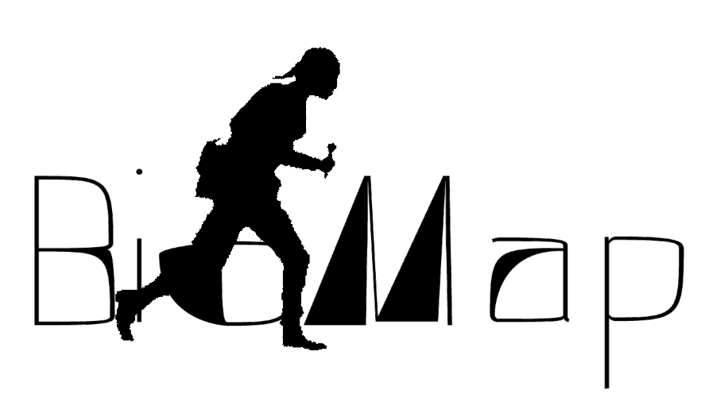

<p align="center">
  
</p>

<p align="center">
  
</p>

<p align="center"><strong>DerivaSonora / SoundWalk Recorder</strong></p>

**ES** — App de mapeo sonoro comunitario. Graba audio geoetiquetado, camina derivas sonoras con tracklog GPS y exporta paquetes ZIP compartibles. Construida con React 18 + Vite, funciona en Android (Capacitor) y navegadores web. Ideal para ciencia ciudadana, investigacion de campo y amantes de la naturaleza.

**EN** — Community sound mapping app. Record geo-tagged audio, walk sonic derives with GPS tracklogs, and export shareable ZIP packages. Built with React 18 + Vite, runs on Android (Capacitor) and web browsers. Ideal for citizen science, field research, and nature enthusiasts.

## Features / Funcionalidades

- **Deriva Sonora** — GPS-tracked walks with auto-pause/resume on movement (>5m), timer, distance and recording counter. Auto-exports ZIP on finish.
- **Audio recording** — Geo-tagged recordings with metadata (species, weather, notes). Offline-first via localStorage.
- **Playback modes** — Nearby, chronological, concatenated (Jamm).
- **Breadcrumb visualization** — Line, heatmap, animated. Always-visible mode icons.
- **Import/Export** — Import derive ZIPs, per-user colored tracklogs on map. Export includes GeoJSON, GPX, CSV, audio and timeline.
- **Multi-layer map** — OSM, Topo, Carto, Humanitarian, Satellite (Leaflet).

## Quick Start

```bash
npm install
npm run dev          # http://localhost:5173
npm run build        # dist/
```

### Android APK

```bash
npm run build
npx cap sync android
cd android && ./gradlew assembleRelease
# or use: bash build-apk.sh
```

## Stack

React 18, Vite, Leaflet, Capacitor, JSZip, Web Audio API

## Links

- **Web**: https://biomapp.vercel.app
- **Contact**: ping@radiolibre.xyz
- **Project**: https://etc.radiolibre.xyz
